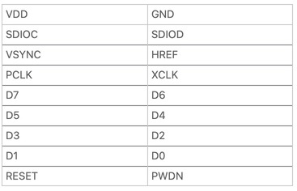

# ESP32 OV7670 Object Detection & Text-to-Speech System

This repository contains the code and documentation for a project that uses an ESP32 microcontroller with an OV7670 camera module to capture video frames, stream them over WiFi, and perform object detection on a laptop using a YOLOv11x model. Detected objects are then announced using text-to-speech (TTS), making the system suitable for assistive applications and real-time environment description.

## Table of Contents

- [Overview](#overview)
- [Features](#features)
- [Hardware Setup](#hardware-setup)
- [Software Setup](#software-setup)
- [Usage](#usage)
- [Project Workflow](#project-workflow)
- [Future Enhancements](#future-enhancements)
- [References](#references)

## Overview

This project leverages the low-cost ESP32 and OV7670 camera to build a real-time object detection system. The ESP32 captures images and streams them via WiFi, while a laptop running Python retrieves these frames, processes them with a YOLOv11x model for object detection, and provides audible feedback using TTS. This enables the system to "describe" the surroundings in real time.

## Features

- **Real-Time Image Capture:**  
  The OV7670 camera module captures frames continuously at QQVGA (160×120) resolution (with potential modifications for higher resolutions).

- **WiFi Streaming:**  
  The ESP32 hosts a web server that streams images in BMP format, making it accessible through a browser.

- **Remote Object Detection:**  
  A Python application running on a laptop fetches the camera stream, processes the frames using the YOLOv11x model, and detects objects in real time.

- **Text-to-Speech (TTS) Feedback:**  
  Detected objects are announced using a text-to-speech engine, providing an audio description of the environment.

- **Configurable Setup:**  
  The project code includes options for both WiFi streaming and Serial-based image transmission, with a focus on running detection on an external system.

## Hardware Setup

- **ESP32 Microcontroller:**  
  Acts as the main controller to capture and stream images.

  

- **OV7670 Camera Module:**  
  Connected to the ESP32 via I2C (for configuration) and a parallel interface (for image data).

  

- **Connections:**  
  - SDA/SIOC for I2C control  
  - VSYNC, HREF, XCLK, PCLK for synchronization and clock signals  
  - D0–D7 for parallel data output

  

  

- **Optional Components:**  
  - TFT Display (if local viewing is desired)  
  - SD Card Module (for local image storage)  
  - Speaker and DAC/I2S amplifier (if on-device audio output is preferred)

## Software Setup

### ESP32 Firmware

- **Arduino IDE:**  
  Program the ESP32 using the Arduino IDE with the necessary libraries (e.g., OV7670, BMP, WiFi).

- **Key Code Files:**  
  - `ESP32_Object_Detection.ino`: Initializes the OV7670, captures images, and streams them over WiFi.
  - Modified versions of `OV7670.h` and `OV7670.cpp` to support different resolutions (QQVGA, VGA, etc.).

### Laptop Python Environment

- **Python 3.x:**  
  Required to run the object detection and TTS application.

- **Required Libraries:**  
  - `opencv-python` for image processing and display.  
  - `requests` to fetch the image stream from the ESP32.  
  - `ultralytics` (YOLOv11x model) for object detection.  
  - `pyttsx3` (or macOS’s built-in `say` command) for text-to-speech.

- **Installation Example:**
  ```bash
  pip install opencv-python requests ultralytics pyttsx3
